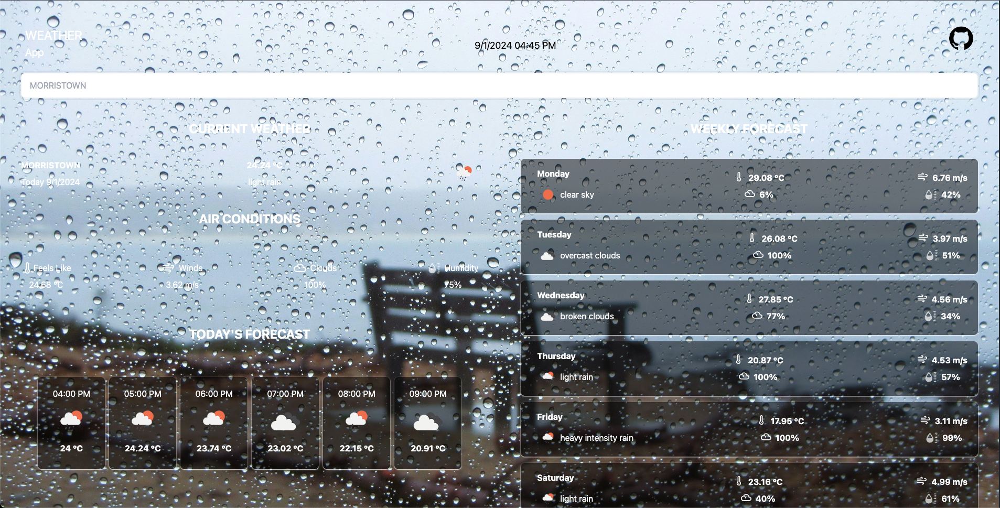

# Weather App

Welcome to the AI-Powered Weather App! This project is designed to provide real-time weather information with a visually appealing and responsive user interface. The app dynamically changes the background based on the current weather conditions, offering users an immersive experience. Built with modern web technologies, the app is efficient, scalable, and easy to use.

## Features

- **Real-Time Weather Data**: Fetches real-time weather data from a reliable weather API.
- **Dynamic Backgrounds**: The background changes according to the current weather conditions, such as sunny, rainy, cloudy, etc.
- **Responsive Design**: Optimized for various screen sizes, including mobile, tablet, and desktop.
- **User-Friendly Interface**: Intuitive design for easy navigation and quick access to weather information.
- **AI Integration**: Provides personalized weather insights based on user preferences.

## Technologies Used

- **Frontend**:

  - HTML5
  - CSS3 (Tailwind CSS, DaisyUI)
  - JavaScript
  - ReactJS

- **Backend**:
  - Node.js (optional if using a server-side integration)
- **APIs**:

  - Weather API (RapidAPI integration)

- **State Management**:
  - Redux

## Installation

To run the AI-Powered Weather App locally, follow these steps:

1. **Clone the repository**:

   ```bash
   git clone https://github.com/YourUsername/AI-Powered-Weather-App.git
   cd AI-Powered-Weather-App
   ```

2. **Install dependencies**:

   ```bash
   npm install
   ```

3. **Set up environment variables**:

   - Create a `.env` file in the root directory.
   - Add your API key and other necessary environment variables.

   ```bash
   REACT_APP_WEATHER_API_KEY=your_api_key_here
   ```

4. **Start the development server**:

   ```bash
   npm run dev
   ```

5. **Access the app**:
   - Open your browser and go to `http://localhost:5173`.

## Screenshots

### Main Page

![Clear Sky] (./public/assets/screenshots/clearSky.png)

### Product List



### Product Details


### Wishlist


## Video Demo

[](https://www.youtube.com/watch?v=your_video_id_here)

## Contributing

If you'd like to contribute to this project, please follow these steps:

1. **Fork the repository**.
2. **Create a new branch**:
   ```bash
   git checkout -b feature-branch
   ```
3. **Make your changes**.
4. **Commit your changes**:
   ```bash
   git commit -m 'Add some feature'
   ```
5. **Push to the branch**:
   ```bash
   git push origin feature-branch
   ```
6. **Open a Pull Request**.

## License

This project is licensed under the MIT License.

## Contact

If you have any questions, feel free to contact me at [your-email@example.com](mailto:your-email@example.com).

---

**Note**: This is a hypothetical example. Replace placeholder content (e.g., links, paths, etc.) with actual data relevant to your project.
